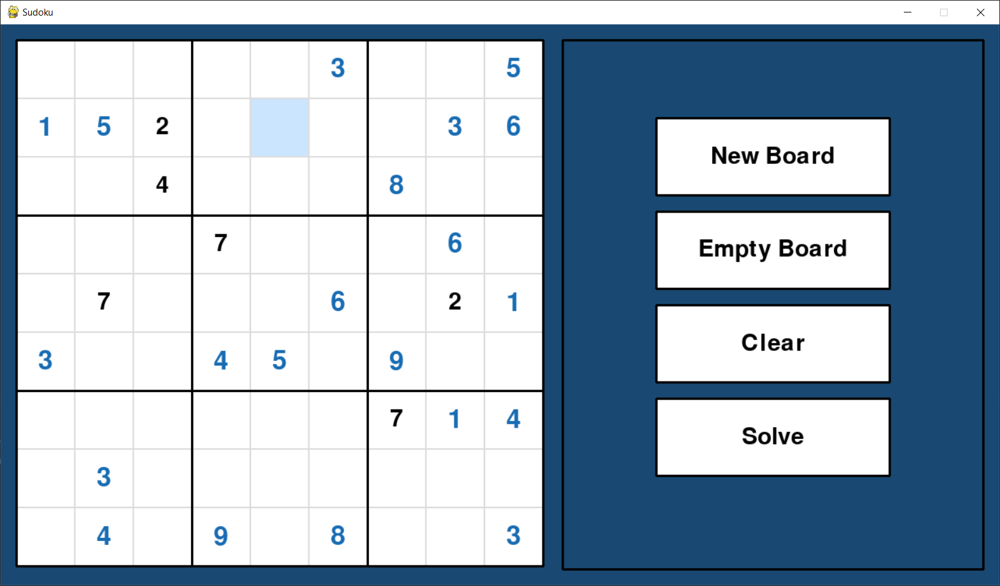

# Sudoku
> A sudoku board generator and solver usning backtracking algorithm with Python.

# Screenshots

# Requirements
## Windows and Mac
- Install pyhton3: [https://www.python.org/download/releases/3.0/](https://www.python.org/download/releases/3.0/)
- Install pygame: **pip install pygame** (*pip3 install pygame, python3 -m pip install pygame*)
- Run the game: **python game.py** (*python3 game.py*)

## Linux
- Install pyhton3:
  - **sudo apt-get update**
  - **sudo apt-get install python3.6**
- Install pygame: **sudo apt-get install python3-pygame**
- Run the game: **python3 game.py**
